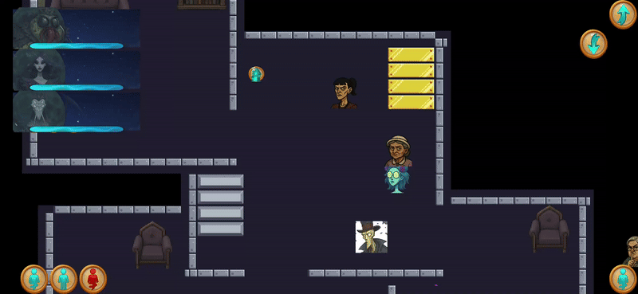

# [Projekt komercyjny (prace w toku) - 2025]


# 📱 Nazwa aplikacji: Happy Haunting
> ⚠️ Projekt w trakcie rozwoju – aktualnie priorytetem są funkcjonalności. Grafiki i zasoby są tymczasowe.
Aplikacja jest zarówno eksperymentalna jak i przygotowywana do wersji produkcyjnej.

Do produkcji wykorzystano technologie:
### 🛠 Technologie
- Flutter  
- Flame (silnik gier 2D)  
- Dart  
- Hive (lokalna baza danych)


## 🎮 O grze
**Happy Haunting** to gra, w której gracz wciela się w rolę dowódcy duchów. Użytkownik odwiedza kolejne poziomy, na których ma za zadanie uwolnić uwięzione duchy i wypłoszyć obecnych smiertelników.


## ✨ Funkcje
Zaimplementowane już funkcjonalności.
  - Odwiedzanie poziomów, zaprojektowanych w programie Tiled (obecne są piętra budynków),
  - Straszenie śmiertelników (NPC o różnych progach strachu - wypełnienie jednego z pasków skutkuje wypłoszeniem śmiertelnika). Śmiertelnicy mają swój stan, który wpływa na zachowanie obejmujące:
    - krążenie po pomieszczeniach na mapie,
    - interakcje z obiektami,
    - podnoszenie obiektów do tego przeznaczonych,
    - wywoływanie skryptów
    - odsyłanie duchów gracza, jeśli śmiertelnik ma takie zdolności
  - Wykorzystywanie duchów:
      - umieszczanie duchów na mapie na zasadzie zgodności aury - pomieszczenie i duch musza mięć tę samą aurę,
      - używanie zdolności różnego typu - każa moc na swój czas odnowienia
          - zdolności przyzywające śmiertelników z danego piętra, lub całej mapy
          - opętanie śmiertelnika - śmiertelnik staje się niepodatny na obrażenia, a przypięty duch podróżuje ze śmiertelnikiem po mapie
          - efekty obszarowe - moce działające przez pewien czas w pokoju
          - obrażenia celowane - na jednego śmiertelnika, śmiertelników w pomieszczeniu, lub na całej mapie
      - duchy posiadają pasek energii, którego wartość spada w kontakcie z egzorcystą. Regeneracja możliwa jest, kiedy duch nie jest rozłożony na mapie.
  -  Skrypty gry dotyczą:
      - warunków uwalniania duchów (sprawdzanie warunków do spełnienia),
      - pojawiania się śmiertelników,
      - wywoływania akcji, które wykona śmiertelnik,
      - manipulacji obszarem


## 🖼️ Screeny
### 👻 Ekran gry, z widocznymi bocznymi panelami duchów i śmiertelników:


### 👻 Zadawanie obrażeń śmiertelnikom oraz poruszanie się między piętrami

 

### 👻 Uwalnianie ducha - w testowym poziomie może to zrobić śmiertelnik wchodząc w interakcje lub użycie mocy o konkretnym tagu:

 

### 👻 Skrypty w grze - otwarcie zamkniętego pomieszczenia i podniesienie obiektu oraz pojawienie się dodatkowych śmiertelników po spełnieniu określonych warunków:

 

### 👻 Zachowania śmiertelników - krążenie po mapie i wchodzenie w interakcje z obiektami:

 

### 👻 Rozmieszczanie duchów ze wzgędu na zgodnośc aur:


## 🚀 Instalacja i uruchomienie

1. Instalacja:  
   ```bash
   Aplikacja w produkcji. 

## 🔮 Plany rozwoju projektu
- dodanie większej liczby poziomów i trybów gry,  
- rozwinięcie sztucznej inteligencji NPC,  
- praca nad oprawą graficzną i dźwiękową,
- przygotowanie fabuły,
- przygotowanie wersji do Google Play.
- 
## 📝 Mój rozwój
Projekt pomógł mi rozwinąć się w zakresie **Fluttera** i **Darta**, a także **FLAME**. Podczas pracy nad tym projektem nabywam dużo doświadczenia w organizowaniu pracy i dużych projektów.
To również moja pierwsza aplikacja zbudowana Flutter Flame, nad którą pracuję sam od podstaw.
Budowanie tej aplikacji postawiło przede mną kilka wyzwań, które dzięki dużemu zaangażowaniu udało się zrealizować.
Chcę dalej pracować nad aplikacją i rozwijać ją pod różnymi względami. Aplikacja bowiem stanowi szkielet dla dalszego rozwoju.
