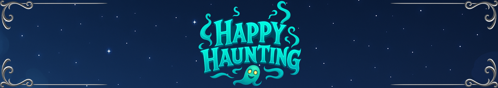

# [Commercial project (work in progress) - 2025]


# 📱 App name: Happy Haunting
> ⚠️ Project under development – functionality is currently the priority. Graphics and resources are temporary.
The application is both experimental and being prepared for production release.

The following technologies were used:
### 🛠 Technologies
- Flutter  
- Flame (2D game engine)  
- Dart  
- Hive (local database)


## 🎮 About app
**Happy Haunting** is a game in which the player takes on the role of a ghost commander. The user visits levels, where their task is to free trapped ghosts and scare away the mortals.


## ✨ Features
Already implemented features:
  - Visiting levels designed in Tiled (building floors are present),
- Scaring mortals (NPCs with different fear thresholds - filling one of the bars results in scaring the mortal away). Mortals have their own status, which affects their behavior, including:
    - moving around rooms on the map,
    - interacting with objects,
    - picking up objects intended for this purpose,
    - triggering scripts
    - sending back player spirits, if the mortal has such abilities
- Using spirits:
  - placing spirits on the map based on aura compatibility - the room and the spirit must have the same aura,
  - using different types of abilities - each power has its own cooldown time - abilities that summon mortals from a given floor or the entire map
    - possession of a mortal - the mortal becomes immune to damage, and the attached ghost travels with the mortal across the map
    - area effects - powers that work for a certain amount of time in a room
    - Targeted damage - one mortal, mortals in a room, or across the entire map
   - Spirits have an energy bar, the value of which decreases when in contact with an exorcist. Regeneration is possible when the spirit is not placed on the map.
- Game scripts concern:
  - conditions for releasing spirits (checking conditions to be met),
  - the appearance of mortals,
  - triggering actions to be performed by mortals,
  - manipulation of the area


## 🖼️ Screenshots
### 👻  Game screen, with visible side panels for ghosts and mortals:


### 👻 Dealing damage to mortals and moving between floors:

 

### 👻  Freeing the spirit - in the test level, this can be done by a mortal interacting with or using a power with a specific tag:

 

### 👻 In-game scripts - opening a closed room and picking up an object, as well as the appearance of additional mortals after certain conditions are met:

 

### 👻 Mortals' behavior - moving around the map and interacting with objects:

 

### 👻 Placement of spirits based on aura compatibility:


## 🚀 Installation

1. Installation:  
   ```bash
   Application in development. 

## 🔮 Project development plans
- adding more levels and game modes,
- developing NPC artificial intelligence,
- working on graphics and sound,
- preparing the storyline,
- preparing a version for Google Play.
## 📝 Self-development
The project helped me develop my skills in **Flutter** and **Dart**, as well as **FLAME**. While working on this project, I am gaining a lot of experience in organizing work and large projects.
It is also my first application built with Flutter Flame, which I am working on myself from scratch.

Building this application presented me with several challenges, which I managed to overcome thanks to my strong commitment.
I want to continue working on the application and develop it in various ways. The application is a framework for further development.
